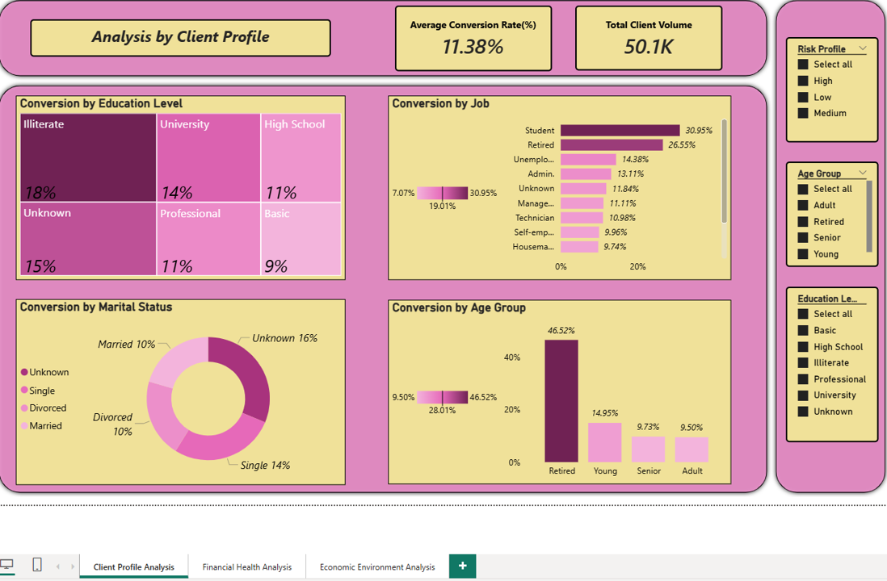

# PBI_Project
PBI Hackio Project

## 📑 Estructura y Analisis del Proyecto: Depósito Bancario & Análisis Macroeconómico
 
**1. Introducción y Objetivo**
Este proyecto analiza la efectividad de una campaña de marketing directo de una institución bancaria portuguesa. El objetivo es predecir si un cliente contratará un depósito a plazo basándose en su perfil demográfico, su historial financiero y el contexto económico actual.
 
 

**2. Cumplimiento de Requisitos**
✅ Dos conjuntos de datos en bruto: Se han utilizado dos fuentes (Datos de Clientes y Datos de Indicadores Económicos)(csv+ .db).

✅ Conjunto de datos final: Tras el merge en Python, el dataset supera las 50,000 filas y 20 columnas requeridas.

✅ Transformación y Limpieza Profunda:

**> Primero en python:**

Cambiamos los puntos por guiones bajos

Columna "Y" Pasamos 'yes'/'no' a 1/0 para poder hacer cálculos matemáticos

Ponemos profesiones en mayúscula y'unknown

Tratamiento de nulos y duplicados en Python (Pandas).

Creación de nuevas variables como age group, risk profile, financial profile...

Simplificacion de niveles educativos

 
 

**> En PowerQuery:**

He considerado añadir un indice a la tabla y dividirla para hacer un modelo estrella porque en otro curso no sdijeronque son buenas praxis y es mejor.
Tenemos una tabla clientes, Una tabla financiera y otra con algunas medidas. Se conectan con el ID
Como en esta base de datos no tenemos datos temporales no he creado Dimension calendario pero igualmente es interesante el analisis de estos datos

✅ Dashboard Operativo: Dashboard en Power BI con arquitectura de Copo de Nieve y filtrado interactivo.

Tres tabs con algunos filtro e indicadores globales

 
 
✅ Organización de Carpetas: Estructura clara en GitHub (/data, /notebooks, /dashboard, /reports).
 
 

**3. Informe Explicativo del Análisis (El "Storytelling")**
 
**> Primero en Python**

Calculando Tasa de conversion
Analisis por grupo de edad
Correlacion variables númericas
Analisis por perfil Riesgo e Educación
Gráficos
 

**> Posteriormente en Powerbi**

Client Profile Analysis tab 
Financial health Analysis 
Economic Environmnet Analysis 
 
 

A. Análisis Descriptivo (Perfil del Cliente)
Hallazgo: La mayor tasa de conversión se encuentra en los extremos de edad (estudiantes y jubilados).

**Impacto: El estado civil "casado" es el más común, pero los "solteros" muestran mayor predisposición a la inversión.**

B. Análisis Estadístico y Financiero (Salud Financiera)
Indicador de Riesgo: Se creó una medida DAX para identificar clientes de "Alto Riesgo" (aquellos con préstamos personales e hipotecas simultáneas).

**Conclusión: Existe una correlación negativa entre tener préstamos activos y la contratación del depósito.**

C. Análisis del Entorno Económico (Macro)
El Factor Euribor: Mediante el uso de Bins, demostramos estadísticamente que cuando el Euribor 3M supera el 1.5%, la conversión cae por debajo del 5%.

**Resiliencia e IPC: El índice de precios al consumidor muestra picos de resistencia donde la inversión se estanca debido a la inflación.**
 
 
 

# Análisis Estadístico
* **Tasa de Conversión Media:** 11.38%.
* **Euribor 3M Promedio:** 3.62.
* **Correlación:** Se observó una correlación negativa significativa entre el nivel de Euribor y la tasa de conversión, validada mediante la agrupación por Bins.

* 
**4. Pasos Seguidos (WorkFlow)**
 
EDA (Python/VS Code): Análisis exploratorio inicial y detección de outliers.

Limpieza (Pandas): Unificación de fuentes de datos mediante merge y normalización de textos.

Modelado (Power BI): Creación de tablas de dimensiones y hechos (Snowflake Schema).

Visualización: Diseño de 3 niveles de análisis (Demográfico, Financiero, Económico).
